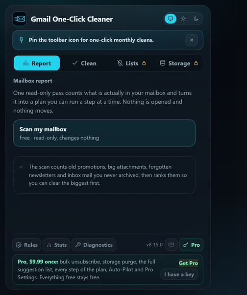

# Gmail One-Click Cleaner

[](https://github.com/TiltedLunar123/gmail-one-click-cleaner/actions/workflows/ci.yml)
[](https://chromewebstore.google.com/detail/bmcfpljakkpcbinhgiahncpcbhmihgpc)
[](https://addons.mozilla.org/en-US/firefox/addon/gmail-one-click-cleaner/)
[](LICENSE)
[]()

A browser extension that bulk-cleans Gmail in one click. Run configurable cleanup rules (promotions, social, newsletters, large attachments, etc.) with a live progress dashboard, dry-run mode, review mode, and safety guardrails.

> Works with Chrome, Edge, Brave, and Firefox. One codebase, per-browser builds.



## Features

### Mailbox Report
One read-only pass counts what is actually in your mailbox and turns it into a ranked plan you can run a step at a time. Nothing is opened and nothing moves during the scan.
- **The whole report is free** - old promotions, big attachments, forgotten newsletters, social and forum mail, and inbox mail you never archived, each with a real count from Gmail's own search.
- **The biggest step is free to run**, so you see the mechanism work on your own mail before deciding anything.
- **Honest numbers** - storage figures are floors built from Gmail's size tiers, so the report says "at least N MB" and means it. Nothing is reconciled against Google's 15 GB bar, which is shared with Drive and Photos.
- **Every step is an ordinary cleanup run** - tagged first, dry-run honoured, whitelist and protected keywords applied, and it shows up in the Recovery Log with one-click Restore.
- **Pro** - every other step, and **Run the whole plan**, which clears the remaining steps of one kind per pass (a run either deletes or archives, never both, so the steps that archive go in their own pass).

### In your language
The popup is available in English, Portuguese (Brazil), Spanish, French, German, Russian and Japanese, following your browser's UI language automatically. The cleaning engine itself adapts to the language your Gmail runs in (17 locales) independently of the popup language.

### Install-source guard
The extension checks how its own copy was installed. A copy planted by third-party software (not installed from an official store) shows a permanent warning and never runs scheduled sweeps, so a sideloaded copy cannot act on a mailbox unattended. Get the real extension from the Chrome Web Store, Firefox Add-ons or Edge Add-ons.

### Smart Suggestions
The extension recommends what to clean instead of making you configure it. One free, read-only scan finds the senders worth cleaning and says why in plain English ("142 emails, 96% unread, mostly older than 6 months").
- **Hard vetoes first** - a sender is never suggested when they match your whitelist or protected keywords, when any of their mail is starred, or when your Sent folder shows you write to them.
- **One-click apply** - each suggestion runs as an ordinary cleanup (tag first, dry-run honored, undo log, stats), so nothing new can touch mail. Dismissed suggestions stay silent for 90 days.
- **The right action per sender** - storage hogs lead with a purge, stopped floods with a delete, and a sender who still emails weekly while you never open them leads with Unsubscribe (Pro), because deleting would not stop the next batch.
- **Pro** - the full suggestion list (top 3 stay free) and bulk apply of checked suggestions, each run honouring the action its own card leads with.

### Auto-Pilot (Pro)
The same Smart Suggestions sweep, on a weekly schedule, so the inbox stays clean without you opening the popup.
- **Preview first** - the first scheduled sweep is always a dry run. The popup shows "would have archived N emails" and waits for an explicit confirm before any sweep touches mail.
- **Archive only** - Auto-Pilot never deletes, whatever a suggestion would normally lead with. Everything it moves is tagged first, capped at 25 senders per sweep, and shows up in stats and the Recovery Log like any other run.
- **Every guard applies** - whitelist, protected keywords, starred and important mail are all respected, and the license is checked on-device before each sweep. No new permissions.

### Cleanup Modes
- **Live Mode** - Automatically labels and moves matching emails to Trash or Archive
- **Review Mode** - Pause before each batch so you can approve or skip
- **Dry-Run** - Count matches without touching anything

### Safety Guardrails
- **Minimum Age** - Never touch emails newer than your chosen cutoff (3m, 6m, 1y, etc.)
- **Global Whitelist** - Protect specific senders/domains from all rules
- **Protected Keywords** - Protect any message whose *subject* contains your words/phrases (e.g. `tax`, `invoice`, `"flight confirmation"`) from every rule. Applies to manual and scheduled runs.
- **Safe Mode** - Skips riskier categories (receipts, order confirmations, shipping updates)
- **Skip Starred & Important** - Automatically excluded when enabled
- **One-click Restore** - Every tagged run in the Recovery Log has a Restore button that moves that run's mail back to your Inbox using the run's label and Gmail's own Move to Inbox control. Free, like the rest of the safety net.

### Presets
- **Monthly Light Clean** - One-click safe maintenance: Safe Mode + Trash + 3-month age limit

### Focused Targets
One-click chips to clean a single category instead of the full sweep. Each runs a small, age-guarded rule set; all global safety guards still apply.
- **Promotions** - old promotional mail and unsubscribe-bait
- **Big attachments** - large messages and heavy attachments
- **Social & updates** - social, updates, and forum categories
- **No-reply** - newsletters and no-reply senders

### Subscription Scan + Bulk Unsubscribe
Deleting hides old mail; unsubscribing stops new mail. The scan samples your last year of mail for subscription-style senders and lists them by volume. It is a sample, not a census: three searches, first page of results each.
- **Scan (free)** - read-only. Samples the senders behind your subscription-style mail and shows who is filling your inbox. Changes nothing.
- **Bulk unsubscribe (Pro)** - pick the senders you never read and unsubscribe from all of them in one pass. Drives **Gmail's own built-in Unsubscribe control**, never sketchy links inside message bodies. Senders with no one-click option are flagged for manual follow-up.

### Storage X-ray
When Google says your storage is full, the question is *what exactly is eating it*. The X-ray answers by sender.
- **Scan and the full ranked list (free)** - read-only. Walks Gmail's own size searches (`larger:25M`, then the 10 MB and 5 MB tiers) and attributes each large email its tier floor, so every number is a defensible "at least". Shows the total reclaimable estimate and every sender it ranked. Nothing about the list is held back: it is a read-only look at your own mailbox.
- **One-click purge (Pro)** - clear the senders you tick, in one click. A purge is a normal cleanup run: matches are tagged first, land in Trash (30-day safety net), respect your whitelist, protected keywords and every global guard, and show up in the recovery log. An age filter (default: older than 6 months) keeps recent mail out of it.

### Progress Dashboard
- Live progress bar with phase tracking
- Per-rule results table (count, duration, estimated MB freed)
- Activity log with copy/clear controls
- Recovery tools: Reconnect, Re-inject, Cancel

### What's new
- The version number in the popup footer opens the release notes for the last twelve versions, written for people who use the extension rather than people who read the code. Also linked from Settings.
- A dot sits on the version after an update until the notes have been opened once.
- The notes are compiled from `CHANGELOG.md` into the package at build time, so opening them makes no network request.

### Rule Sets
- **Light** - Older mail and large attachments only
- **Normal** - Balanced cleanup (recommended)
- **Deep** - More aggressive (use Dry-Run first)
- **Maximum** - For a mailbox that has never been cleaned: Deep's rules with younger age floors and lower attachment thresholds, plus two more ways of naming uncategorised bulk mail. It never sweeps your Inbox wholesale or a bare age range, and it needs two clicks to start.

Example rules:
```
category:promotions older_than:6m
category:social older_than:1y
has:attachment larger:10M older_than:6m
"unsubscribe" older_than:1y
```

## Pro

Pro is a **one-time $9.99 purchase** (no subscription, **30-day money-back guarantee**) that unlocks six things: the whole Mailbox Report plan, bulk unsubscribe, the one-click Storage X-ray purge, the full Smart Suggestions list with bulk apply, Auto-Pilot, which keeps your inbox clean every week automatically, and **Pro Settings** (the recovery label put on cleaned mail, the Auto-Pilot interval and age floor, how many senders one sweep clears, a deeper Smart scan, and how many entries the recovery log keeps). Keys activate in one click from the page you land on after checkout, in Chrome and Edge; Firefox shows the key to paste. A refunded key keeps working, because verification is offline and there is nothing to revoke. Everything that is free today stays free forever. Compare (prices checked 2026-08-01): Clean Email is $29.99 a year for one account, Trimbox is $39.99 a year, Mailstrom is $59.95 a year, and Google One storage starts at about $20 a year, forever.

- Your license key is checked **entirely on your device** with a built-in public key. The extension never contacts a server, not even to check the license.
- The key is a signed token with no personal data. Stored in Chrome sync, so Pro follows you to your other signed-in browsers.
- Buy Pro from the popup or the extension's Options page. Your key is shown right after checkout; revisiting that page re-issues it if you lose it.
- **Lost your key?** Three ways back, no charge. If Pro is active on any browser, open **Options > Pro License** and use **Show key** / **Copy key**. Otherwise revisit the post-checkout link, or enter the email you paid with at [the recovery page](https://gmail-cleaner-pro.netlify.app/recover.html). Re-issued keys are new tokens for the same purchase, so keys you already have keep working.

---

## Install

### Chrome / Brave / other Chromium
Install from the [Chrome Web Store](https://chromewebstore.google.com/detail/bmcfpljakkpcbinhgiahncpcbhmihgpc).

### Microsoft Edge
Install straight from the [Chrome Web Store](https://chromewebstore.google.com/detail/bmcfpljakkpcbinhgiahncpcbhmihgpc); Edge will ask once to allow extensions from other stores.

### Firefox
Install from [Firefox Add-ons](https://addons.mozilla.org/en-US/firefox/addon/gmail-one-click-cleaner/). Firefox gets its own build with an event-page background; features are identical. If cleanup ever reports a permission problem, click **Allow** on the Gmail access banner in the popup (Firefox lets you revoke site access per extension).

### Developer Mode (Load Unpacked)
1. Clone this repo:
   ```bash
   git clone https://github.com/TiltedLunar123/gmail-one-click-cleaner.git
   ```
2. Open `chrome://extensions` in Chrome
3. Enable **Developer mode** (top-right toggle)
4. Click **Load unpacked** and choose the cloned folder
5. Pin the extension, open Gmail, and click the icon to start

For Firefox, build the dedicated bundle first (`npm run build:firefox`), then load `dist-firefox/` as a temporary add-on from `about:debugging`.

---

## Project Structure

```
gmail-one-click-cleaner/
├── manifest.json         # Chrome extension manifest (MV3)
├── shared.css            # Design tokens & shared component styles
├── shared.js             # Common JS utilities (GCC namespace)
├── background.js         # Service worker (alarms, messaging, stats)
├── contentScript.js      # Gmail DOM automation (injected into Gmail tab)
├── popup.html/js         # Extension popup UI and logic
├── progress.html/js      # Live progress dashboard
├── options.html/js       # Rules & settings page
├── diagnostics.html/js   # Troubleshooting tools
├── stats.html/js         # Statistics dashboard
├── changelog.html/js     # In-extension release notes
├── changelog-data.js     # Generated from CHANGELOG.md by tools/build-changelog.mjs
├── browser-polyfill.js   # Cross-browser compatibility shim
├── build.js              # Build script (copy, minify, zip; --target=firefox)
├── jest.config.js        # Test configuration
├── tests/                # Jest suites incl. Gmail DOM-fixture tests
├── _locales/             # Popup & store-listing translations (7 languages)
├── netlify/              # Pro checkout site + key-issuing function (not shipped in the extension)
├── .github/workflows/    # CI pipeline (lint, test, build)
├── icons/                # Extension icons (16, 32, 48, 128)
├── CHANGELOG.md          # Version history
├── CONTRIBUTING.md       # Contribution guidelines
├── SECURITY.md           # Security policy and permissions docs
└── LICENSE               # MIT License
```

---

## Privacy & Data

- **Runs locally** - All cleanup, scanning, and unsubscribing happen in your browser against the Gmail UI. No email content is ever sent anywhere.
- **No data collection** - No analytics, no tracking, no email content, subjects, or credentials leave your device.
- **One exception worth naming, because it is visible in the source** - each "Get Pro" link carries a fixed label saying which feature it came from (`?client_reference_id=gcc_autopilot`, for example). It travels only if *you* click through to Stripe, it is recorded only if you actually buy, it contains no user or device data, and it exists so the project can tell which feature was worth paying for. Nothing is sent for anyone who does not buy, and the extension itself still transmits nothing.
- **License stays offline** - Pro keys are checked on-device with a built-in public key. The extension never phones home, not even to check the license. The only network calls are ones you start: opening the Stripe checkout page and its post-purchase activation page (part of the purchase flow, not the extension). No Gmail data is involved in either.
- **One page opens when you uninstall** - removing the extension opens a fixed goodbye page on the project's own site, using the browser's `setUninstallURL`. It mostly exists to tell Pro buyers their lifetime key still works and where to have it reissued. The address carries no identifier, no version and nothing from your mailbox. The release notes in the extension are compiled into the package, so reading those costs no request at all.
- **Minimal permissions** - `activeTab`, `scripting`, `tabs`, `storage`, `alarms`, `notifications` + Gmail host access. No new permissions were added for Pro.
- **30-day safety net** - Gmail keeps Trash for ~30 days, and every run is labeled before it moves. The Recovery Log's one-click Restore puts a run back in your Inbox; archived runs can come back any time, deleted runs within the 30-day window.

See [SECURITY.md](SECURITY.md) for the full security policy and permissions breakdown, the [privacy policy](https://github.com/TiltedLunar123/gmail-one-click-cleaner/blob/main/PRIVACY.md) for what does and does not leave your browser, and [TERMS.md](TERMS.md) for the terms of use.

---

## Contributing

See [CONTRIBUTING.md](CONTRIBUTING.md) for development setup, project architecture, and guidelines.

---

## License

[MIT](LICENSE)
